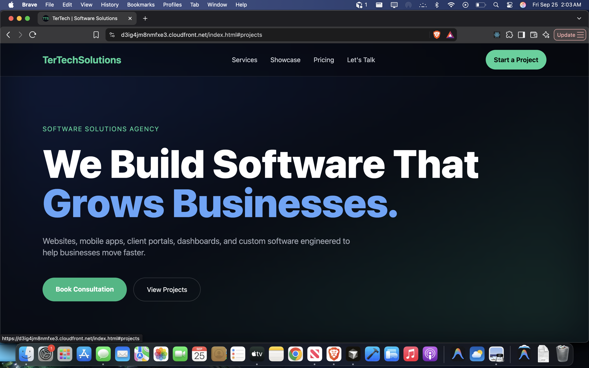
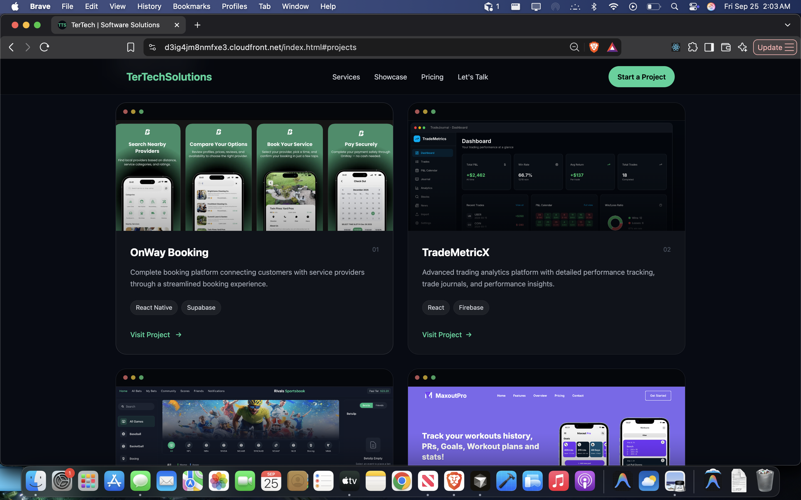

# TerTech

Modern software development and technology solutions website built with Next.js, React, TypeScript, and Tailwind CSS.




[](https://github.com/paulter19/tertechsolutions/actions/workflows/deploy.yml)

## Live Website

https://d3ig4jm8nmfxe3.cloudfront.net

## Overview

TerTech is a software solutions website showcasing custom web applications, mobile applications, dashboards, and software projects.

The site is built with Next.js and statically exported for deployment to AWS. GitHub Actions automatically builds and deploys the application whenever changes are pushed to the `main` branch.

## Tech Stack

* Next.js
* React
* TypeScript
* Tailwind CSS
* Framer Motion
* Lucide React
* AWS S3
* AWS CloudFront
* AWS IAM
* GitHub Actions
* GitHub OIDC

## AWS Architecture

```text
GitHub
   │
   │ Push to main
   ▼
GitHub Actions
   │
   │ npm ci
   │ npm run build
   ▼
Next.js Static Export
   │
   │ out/
   ▼
Amazon S3
   │
   │ Private bucket
   │
   ▼
CloudFront
   │
   │ Origin Access Control
   ▼
Users
```

## CI/CD Pipeline

Every push to `main` triggers the deployment workflow.

1. GitHub Actions checks out the repository
2. Node.js 20 is configured
3. Dependencies are installed with `npm ci`
4. Next.js generates a static production build
5. GitHub authenticates to AWS using OIDC
6. AWS IAM assumes the deployment role
7. The `out/` directory is synchronized to S3
8. CloudFront cache is invalidated
9. The updated site becomes available through CloudFront

## AWS Security

The S3 bucket is private and is not directly exposed to the public internet.

CloudFront uses **Origin Access Control (OAC)** to access the S3 bucket.

GitHub Actions does not use long-lived AWS access keys. Instead, it uses **GitHub OIDC** to obtain temporary AWS credentials through an IAM role.

The deployment IAM role follows least-privilege principles and is limited to:

* Listing the TerTech S3 bucket
* Uploading objects
* Deleting objects during deployment synchronization
* Creating CloudFront invalidations

## Monitoring

AWS CloudWatch is used to monitor CloudFront metrics including:

* Requests
* Bytes downloaded
* 4xx error rate
* 5xx error rate

A CloudWatch alarm is configured for elevated CloudFront 5xx errors.

## Project Structure

```text
tertechsolutions/
├── app/
├── public/
├── .github/
│   └── workflows/
│       └── deploy.yml
├── package.json
├── package-lock.json
├── next.config.ts
└── README.md
```

## Local Development

Install dependencies:

```bash
npm ci
```

Start the development server:

```bash
npm run dev
```

Build the production site:

```bash
npm run build
```

The static production output is generated in:

```text
out/
```

## Deployment

Deployment is handled automatically through GitHub Actions.

```text
git push origin main
```

Triggers:

```text
GitHub Actions
      ↓
Next.js Build
      ↓
AWS OIDC
      ↓
IAM Role
      ↓
S3
      ↓
CloudFront
```

## Future Improvements

* Custom domain with Route 53
* AWS Certificate Manager HTTPS certificate
* Backend API
* Database integration
* Additional CloudWatch monitoring
* Staging environment
* Automated tests in CI
* Infrastructure as Code
* Blue/green or staged deployments

## Author

Paul T

GitHub: https://github.com/paulter19
